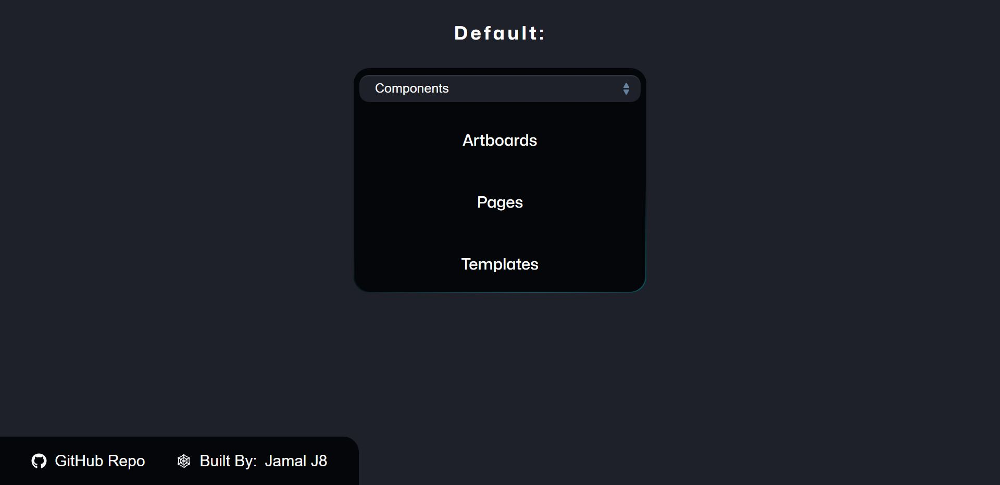

# Jackie's Pet Store - CodePen - The Most Hearted Pens of 2023

## Screenshot Of The Original Design By: Jackie Zen


## Screenshot Of My Version:




## Features

```
[x] Single page application built with React (SPA) - Landing page
[x] Nav Menu (no links work right now - just a demo)
    [x] Hover sub menus on full width screens
[x] Responsive (Original was not completely responsive)
[ ] 
[ ] 

```

## Bugs / Fixes

### Using Logical `AND` (`&&`) and `OR` (`||`) in React Rendering

I was running into an issue where values that should be truthy were coming up falsey and vice versa. Looked into it and found two useful pieces of information. 

1. React renders any value with a type of `string` or `number` regardless of whether it's falsey. So in a scenario when we want to use the length of an array as the first value in an `AND` statement, React would still render a length of `0` when the array is empty. Therefore, we need to explicitly cast the array length value as a boolean value using a double bang (`!!`), the `Boolean(value)` constructor, or use a ternary operator instead of a Logical `AND`. React does not render values of type `boolean`, `null`, or `undefined`. - [Reference Stack Overflow](https://stackoverflow.com/questions/53048037/react-showing-0-instead-of-nothing-with-short-circuit-conditional-component)

2. JavaScript does not automatically convert "truthy" values to `true` in a `==` comparison. For example, in JavaScript an empty array (`[]`) is considered a "truthy" value but a statement like `[] == true` will return `false`. You need to explicitly cast the array as a boolean before running the comparison operation to get the correct value - for example:

```js
console.log(Boolean([]) == true)        // Output: true
console.log(!![] == true)               // Output: true
```

- ["falsey" and "truthy" values in JavaScript - MDN Docs](https://developer.mozilla.org/en-US/docs/Glossary/Falsy)
- [2 Ways to Convert Values to Boolean in JavaScript - article](https://www.samanthaming.com/tidbits/19-2-ways-to-convert-to-boolean/) 
- [Consider When and Where logical operators should be used to render React components - Stack Overflow](https://stackoverflow.com/questions/65713434/react-render-logical-vs-ternary-operator)

### Images Were Resizing Perfectly Without a Set Height

This is not necessarily a bug but rather something that was interesting to note from the original code. On the "Shop Products" there are cards with images representing each cateogory of pet products. On large-width screens The cards are in a `flex-container`. The images are perfectly contained to fit in the same size container. This is accomplished through the use of three CSSS properties: 

1. [`flex: 1`- MDN Docs](https://developer.mozilla.org/en-US/docs/Web/CSS/flex)
2. [`aspect-ratio: 3/2` - MDN Docs](https://developer.mozilla.org/en-US/docs/Web/CSS/aspect-ratio)
3. [`object-fit: contain` - MDN Docs](https://developer.mozilla.org/en-US/docs/Web/CSS/object-fit)

By setting the `flex: 1` property value on each flex-item (i.e. card) in the `flex-container` we are actually setting the `flex-grow` property from the default of `0` to `1`. This makes it so that each `flex-item` (i.e. card) has the same width and height because they grow and fill up the space of the `flex-container` at an equal rate. 

When each card has the same height and width the `aspect-ratio` property will size the image container the same on each card.

Finally, with each image container being the same, regardless of the differences in image size, each one will automatically be resized to fit within the container using the `object-fit: contain` property value. This results in the desired look of equal card images.

It took a while for me to figure out what I was missing since I normally don't use the `aspect-ratio` property and I just set a height value manually. This was a frustrating to breakdown but beneficial to go over. Hence the notes on this. lol

### Use `margin-top: auto` to push the Last element to the bottom of the Container

An interesting use case for `margin: auto`. This was used to push the last item (a button) in the card to the bottom regardless of how many bullet points were above. This is an interesting way to accomplish this as in the past I would use `align-items: space-between` or in a grid layout, `align-self: flex-end`. I will keep this approach in my back pocket as it might be useful in the future.

--- 

# Getting Started with Create React App

This project was bootstrapped with [Create React App](https://github.com/facebook/create-react-app).

## Available Scripts

In the project directory, you can run:

### `npm start`

Runs the app in the development mode.\
Open [http://localhost:3000](http://localhost:3000) to view it in your browser.

The page will reload when you make changes.\
You may also see any lint errors in the console.

### `npm test`

Launches the test runner in the interactive watch mode.\
See the section about [running tests](https://facebook.github.io/create-react-app/docs/running-tests) for more information.

### `npm run build`

Builds the app for production to the `build` folder.\
It correctly bundles React in production mode and optimizes the build for the best performance.

The build is minified and the filenames include the hashes.\
Your app is ready to be deployed!

See the section about [deployment](https://facebook.github.io/create-react-app/docs/deployment) for more information.

### `npm run eject`

**Note: this is a one-way operation. Once you `eject`, you can't go back!**

If you aren't satisfied with the build tool and configuration choices, you can `eject` at any time. This command will remove the single build dependency from your project.

Instead, it will copy all the configuration files and the transitive dependencies (webpack, Babel, ESLint, etc) right into your project so you have full control over them. All of the commands except `eject` will still work, but they will point to the copied scripts so you can tweak them. At this point you're on your own.

You don't have to ever use `eject`. The curated feature set is suitable for small and middle deployments, and you shouldn't feel obligated to use this feature. However we understand that this tool wouldn't be useful if you couldn't customize it when you are ready for it.

## Learn More

You can learn more in the [Create React App documentation](https://facebook.github.io/create-react-app/docs/getting-started).

To learn React, check out the [React documentation](https://reactjs.org/).

### Code Splitting

This section has moved here: [https://facebook.github.io/create-react-app/docs/code-splitting](https://facebook.github.io/create-react-app/docs/code-splitting)

### Analyzing the Bundle Size

This section has moved here: [https://facebook.github.io/create-react-app/docs/analyzing-the-bundle-size](https://facebook.github.io/create-react-app/docs/analyzing-the-bundle-size)

### Making a Progressive Web App

This section has moved here: [https://facebook.github.io/create-react-app/docs/making-a-progressive-web-app](https://facebook.github.io/create-react-app/docs/making-a-progressive-web-app)

### Advanced Configuration

This section has moved here: [https://facebook.github.io/create-react-app/docs/advanced-configuration](https://facebook.github.io/create-react-app/docs/advanced-configuration)

### Deployment

This section has moved here: [https://facebook.github.io/create-react-app/docs/deployment](https://facebook.github.io/create-react-app/docs/deployment)

### `npm run build` fails to minify

This section has moved here: [https://facebook.github.io/create-react-app/docs/troubleshooting#npm-run-build-fails-to-minify](https://facebook.github.io/create-react-app/docs/troubleshooting#npm-run-build-fails-to-minify)


---

## Meta Data

Started On: 2024-01-09

### References:

- [Inspiration - CodePen - Responsive Dashboard | Bento Style - Ecem Gokdogan](https://codepen.io/jackiezen/pen/oNJMOvZ?editors=0010)
- [Fontawesome for the icons](https://fontawesome.com/icons/)
- [Favicon Generator](https://www.favicon-generator.org/)
- [Color Palette Selector - Coolors.co](https://coolors.co/001524-ff7d00-417b5a-cedfd9-78290f)
- [Hex to RGB Converter](https://www.rgbtohex.net/hex-to-rgb/)
- []()
- []()
- []()
